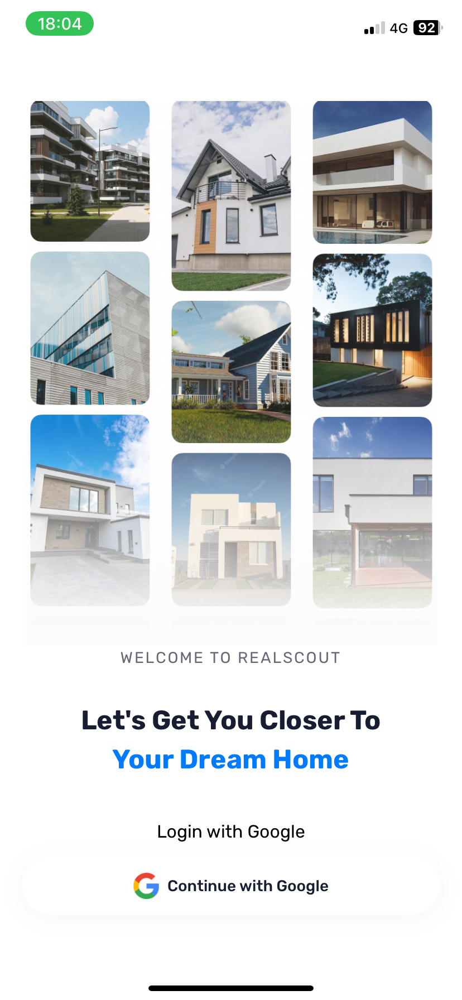
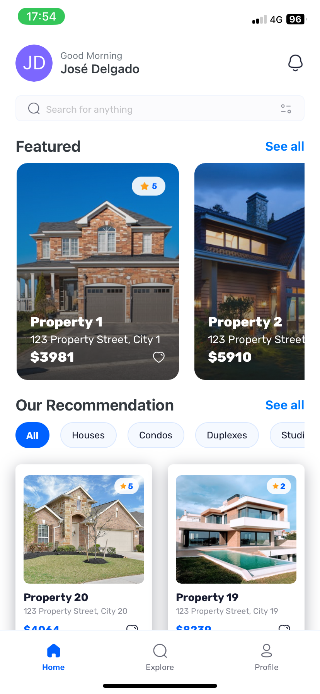
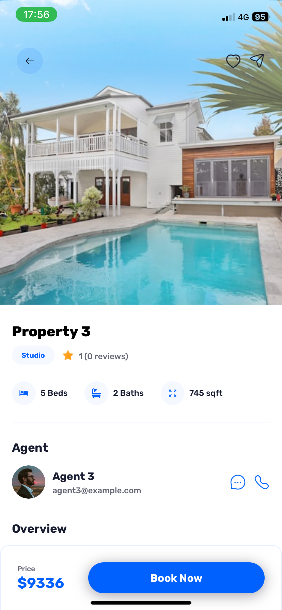
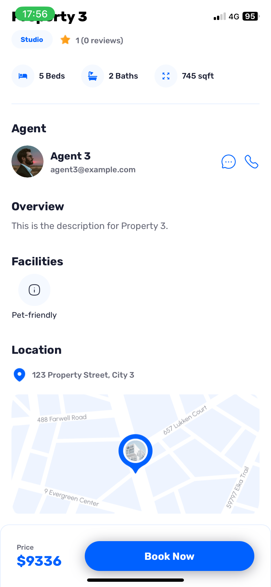
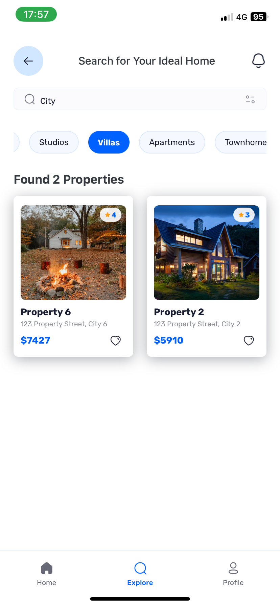
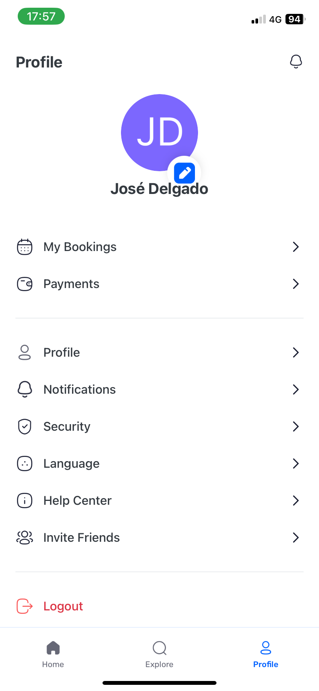

# RealScout App

Este proyecto es una aplicación móvil para la compra de inmuebles. La aplicación utiliza **React Native**, **Expo**, y **Appwrite** para gestionar datos y usuarios. A continuación, se muestra una descripción detallada de la funcionalidad y las tecnologías utilizadas.

## 📋 Descripción

RealScout permite a los usuarios explorar propiedades, ver detalles de cada inmueble, contactar con agentes, y gestionar su perfil. La aplicación está diseñada para ofrecer una experiencia intuitiva, fluida y optimizada tanto para dispositivos móviles como para pantallas web.

## ⚙️ Tech Stack

- **React Native**
- **Expo**
- **Appwrite** para la gestión de datos y autenticación
- **Tailwind CSS (NativeWind)** para estilos rápidos y responsivos

## 🔋 Características

- **Onboarding y Registro**: Proceso de bienvenida con autenticación de usuario.
- **Explorar Propiedades**: Explora una lista de inmuebles, filtra por características y realiza búsquedas.
- **Detalles del Inmueble**: Información completa del inmueble, incluyendo imágenes, características, y ubicación.
- **Perfil de Usuario**: Gestiona tu cuenta y revisa tus preferencias.
- **Contactar con Agentes**: Comunicación directa con agentes mediante llamadas o mensajes.
- **Facilidades y Galería**: Visualiza comodidades y una galería de imágenes del inmueble.
- **Mapa de Ubicación**: Muestra la ubicación exacta del inmueble en un mapa interactivo.

## 🤸 Capturas de Pantalla

### 1. Login

  

### 2. Exploración de Propiedades

  

### 3. Detalles del Inmueble

  
  

### 4. Búsqueda Full-Text con Filtros

  

### 5. Perfil de Usuario

  

## 🚀 Próximas Funcionalidades

- **Favoritos**: Guarda tus inmuebles favoritos para revisarlos más tarde.
- **Notificaciones**: Alertas para actualizaciones de propiedades y mensajes de agentes.
- **Sistema de Reseñas**: Agrega y visualiza reseñas sobre inmuebles y agentes.
- **Soporte Multilenguaje**: Disponibilidad en varios idiomas.
